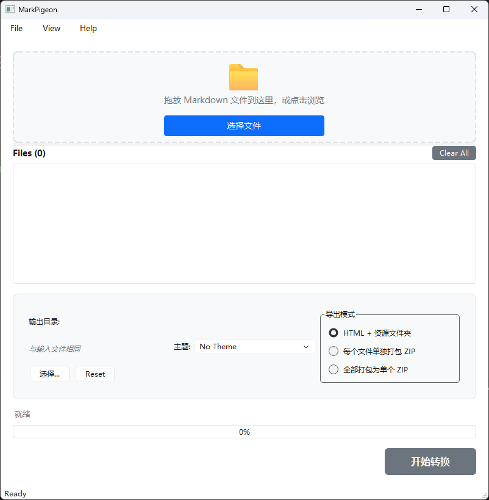

# MarkPigeon

<div align="center">
  <!-- Logo Placeholder -->
  
  
  <h3>让 Markdown 文档分享变得优雅简单。</h3>

  [](https://github.com/steven-jianhao-li/MarkPigeon/releases)
  [](LICENSE)
  [](https://github.com/steven-jianhao-li/MarkPigeon/releases)
  [](https://github.com/steven-jianhao-li/MarkPigeon/actions)
</div>

---

**MarkPigeon** 是一款专为科研人员和作者设计的工具。它能将 Markdown 批量转换为带样式的 HTML，并**智能打包本地图片资源**，彻底解决"发给别人图片就挂了"的痛点。

[English Docs](README.md) | [下载最新版](https://github.com/steven-jianhao-li/MarkPigeon/releases)

## ✨ 核心功能

* **🚀 开箱即用**: **无需安装 Python！** 下载可执行文件，双击即可使用。
* **🎨 Typora 完美伴侣**: 直接复用你喜欢的 Typora CSS 主题，无缝迁移体验。
* **📦 智能资源隔离**: 自动提取文档中的图片，复制到独立的 `assets_<文件名>` 文件夹，并自动修正 HTML 路径。
* **🤐 一键压缩打包**: 支持将每个文档及其资源单独打包成 Zip，方便微信/邮件发送。
* **🌍 多语言支持**: 界面支持 简体中文 / English。
* **🖥️ 双模式**: 提供易用的图形界面 (GUI) 和 高效的命令行 (CLI)。

## 📸 软件截图


*基于 PySide6 构建的现代化界面*

## 🚀 快速开始

### 方法 1: 使用界面版 (推荐)
1. 在 [Releases](https://github.com/steven-jianhao-li/MarkPigeon/releases) 下载最新版。
2. 拖入 Markdown 文件或文件夹。
3. 选择喜欢的主题（如 GitHub），点击 **开始转换**。

### 方法 2: 命令行
```bash
# 转换单个文件
markpigeon report.md --theme github

# 转换并打包为 Zip
markpigeon report.md --theme github --zip

# 批量转换目录
markpigeon docs/ --output dist/ --recursive

# 查看可用主题
markpigeon --list-themes
```

## 📋 导出模式

| 模式 | 说明 | 适用场景 |
|------|------|----------|
| **默认** | HTML + `assets_` 文件夹 | 本地浏览、编辑 |
| **独立 Zip** | 每个 MD → 单独 Zip | 邮件发送单个文档 |
| **汇总 Zip** | 所有输出 → 一个 Zip | 分享整个项目 |

## 🎨 主题使用

MarkPigeon 内置 GitHub 风格主题，同时支持任何 Typora 兼容的 CSS：

1. 将 `.css` 文件放入 `themes/` 目录
2. 在 GUI 下拉框选择，或在 CLI 使用 `--theme 主题名`

## 🛠️ 开发者指南

如果您想参与开发：

```bash
# 1. 克隆仓库
git clone https://github.com/steven-jianhao-li/MarkPigeon.git
cd MarkPigeon

# 2. 创建虚拟环境
python -m venv venv
.\venv\Scripts\activate  # Windows
source venv/bin/activate  # macOS/Linux

# 3. 安装依赖
pip install -r requirements.txt

# 4. 运行 GUI
python -m src.main

# 5. 运行测试
pytest
```

### 项目结构

```
MarkPigeon/
├── src/
│   ├── core/           # 核心业务逻辑（无 UI 依赖）
│   │   ├── i18n.py     # 国际化
│   │   ├── parser.py   # Markdown 解析
│   │   ├── renderer.py # HTML 渲染
│   │   ├── packer.py   # Zip 打包
│   │   └── converter.py # 流程编排
│   ├── interfaces/
│   │   ├── cli/        # 命令行界面
│   │   └── gui/        # 图形界面
│   └── main.py         # 入口
├── locales/            # 翻译文件
├── themes/             # CSS 主题
└── scripts/            # 发布脚本
```

## 🔄 发布新版本

使用自动化发布脚本：

```bash
python scripts/release.py

# 脚本会提示：
# ? Select release type:
# 1) Patch (1.0.0 -> 1.0.1)
# 2) Minor (1.0.0 -> 1.1.0)
# 3) Major (1.0.0 -> 2.0.0)
# 
# 确认后，脚本自动完成 Commit -> Tag -> Push
```

## 📄 开源协议

MIT 许可证。详见 [LICENSE](LICENSE)。

## 🤝 参与贡献

欢迎提交 Pull Request！

1. Fork 本仓库
2. 创建特性分支 (`git checkout -b feature/amazing-feature`)
3. 提交更改 (`git commit -m 'Add amazing feature'`)
4. 推送分支 (`git push origin feature/amazing-feature`)
5. 发起 Pull Request

## 📈 Star History

[](https://star-history.com/#steven-jianhao-li/MarkPigeon&Date)

## 👥 贡献者

感谢所有为本项目做出贡献的开发者！

<a href="https://github.com/steven-jianhao-li/MarkPigeon/graphs/contributors">
  
</a>

